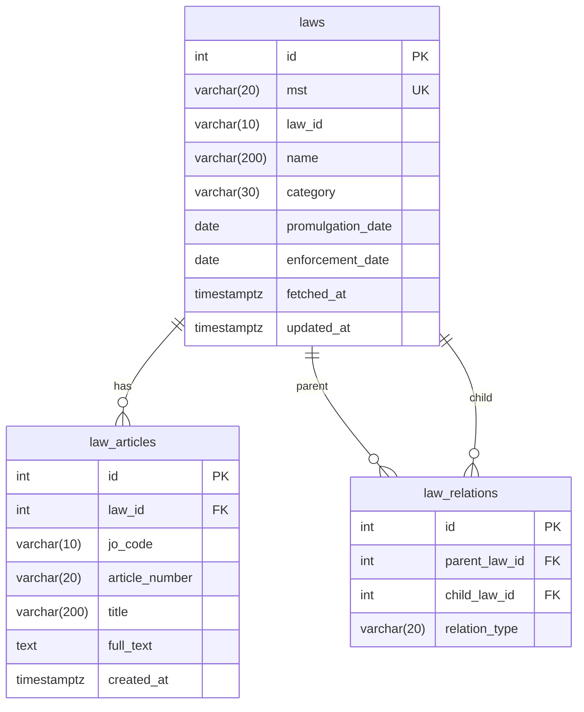

# RDB/

법령 데이터 저장용 PostgreSQL 설정 및 마이그레이션 관리.

## 구성

| 파일/디렉터리 | 설명 |
|---------------|------|
| `docker-compose.yml` | PostgreSQL 컨테이너 설정 |
| `alembic.ini` | Alembic 설정 파일 |
| `alembic/` | 마이그레이션 스크립트 |

테이블 3개: `laws`, `law_articles`, `law_relations`  
SQLAlchemy 모델 정의: `backend/app/models/law.py`

---

## Schema

실제 PostgreSQL `\d` 출력 기준 현재 schema는 아래와 같다.



### `laws`

법령 메타데이터를 저장한다.

| 컬럼 | 타입 | 제약 | 설명 |
|------|------|------|------|
| `id` | `integer` | PK | 내부 PK |
| `mst` | `varchar(20)` | NOT NULL, UNIQUE | 외부 법령 식별자(수집/업서트 기준 키) |
| `law_id` | `varchar(10)` | NULL | 법제처/외부 시스템 법령 ID |
| `name` | `varchar(200)` | NOT NULL | 법령명 |
| `category` | `varchar(30)` | NULL | 법령 종류(법률/시행령/규칙 등) |
| `promulgation_date` | `date` | NULL | 공포일 |
| `enforcement_date` | `date` | NULL | 시행일 |
| `fetched_at` | `timestamptz` | NOT NULL, default `now()` | 최초 수집 시각 |
| `updated_at` | `timestamptz` | NOT NULL, default `now()` | 마지막 갱신 시각 |

### `law_articles`

개별 법령의 조문 본문을 저장한다.

| 컬럼 | 타입 | 제약 | 설명 |
|------|------|------|------|
| `id` | `integer` | PK | 내부 PK |
| `law_id` | `integer` | NOT NULL, FK → `laws.id` | 소속 법령 ID |
| `jo_code` | `varchar(10)` | NULL | 조문 식별 코드(유니크 키 구성 요소) |
| `article_number` | `varchar(20)` | NULL | 표시용 조문 번호 문자열 |
| `title` | `varchar(200)` | NULL | 조문 제목/표제 |
| `full_text` | `text` | NOT NULL | 조문 본문 전문 |
| `created_at` | `timestamptz` | NOT NULL, default `now()` | 레코드 생성 시각 |

추가 제약:

| 제약명 | 내용 |
|--------|------|
| `law_articles_law_id_jo_code_key` | UNIQUE (`law_id`, `jo_code`) |

### `law_relations`

법령 간 상하위 또는 위임 관계를 저장한다.

| 컬럼 | 타입 | 제약 | 설명 |
|------|------|------|------|
| `id` | `integer` | PK | 내부 PK |
| `parent_law_id` | `integer` | NOT NULL, FK → `laws.id` | 상위/근거 법령 ID |
| `child_law_id` | `integer` | NOT NULL, FK → `laws.id` | 하위/종속 법령 ID |
| `relation_type` | `varchar(20)` | NULL | 관계 유형(시행령/시행규칙/위임 등) |

추가 제약:

| 제약명 | 내용 |
|--------|------|
| `law_relations_parent_law_id_child_law_id_key` | UNIQUE (`parent_law_id`, `child_law_id`) |

### 관계 요약

- `laws` 1 : N `law_articles`
- `laws` 1 : N `law_relations` (`parent_law_id`)
- `laws` 1 : N `law_relations` (`child_law_id`)

## Docker 실행

```bash
# 컨테이너 시작
docker compose -f RDB/docker-compose.yml up -d

# 컨테이너 상태 확인
docker compose -f RDB/docker-compose.yml ps

# 컨테이너 중지
docker compose -f RDB/docker-compose.yml down
```

## 마이그레이션

```bash
# 마이그레이션 적용
alembic -c RDB/alembic.ini upgrade head

# 현재 상태 확인
alembic -c RDB/alembic.ini current

# 새 마이그레이션 생성 (모델 변경 후)
alembic -c RDB/alembic.ini revision --autogenerate -m "설명"
```

## DB 접속 및 조회

```bash
# psql 접속
docker exec -it jeonse_postgres psql -U postgres -d jeonse_db

# 테이블 목록
\dt

# 데이터 확인 예시
SELECT name, mst FROM laws;
SELECT COUNT(*) FROM law_articles GROUP BY law_id;
```

---

## 법령 데이터 수집

이 DB에 법령 데이터를 수집·적재하는 코드는 **`scripts/`** 에 있다.  
자세한 내용은 [`scripts/README.md`](../scripts/README.md) 참고.

```bash
# 전체 법령 수집
python scripts/ingest_laws.py

# 특정 법령만
python scripts/ingest_laws.py --only "부동산등기법"
```
