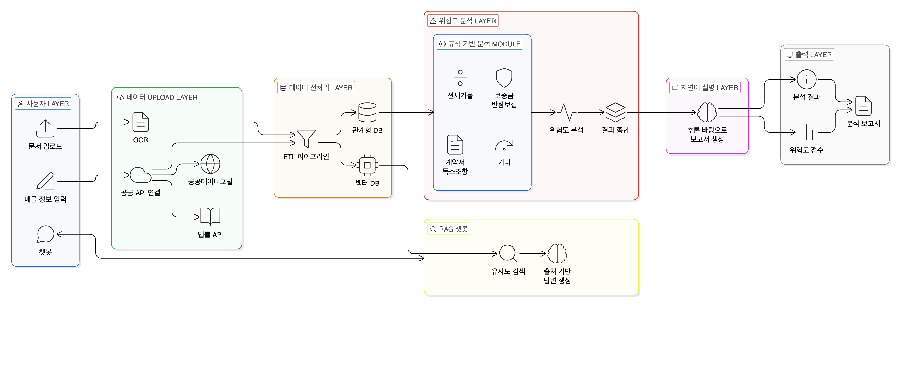

# AI 기반 전세 계약 사기 예방 및 법률 지원 시스템

## 🔗 배포 사이트 — https://capstone-jeonse-risk-analysis-ai.vercel.app



이 프로젝트는 전세 계약 과정에서 발생할 수 있는 사기 위험을 줄이고, 사용자가 계약 전후에 필요한 정보를 빠르게 확인할 수 있도록 돕는 시스템이다.  
핵심 목표는 다음 세 가지다.

1. 계약 전 매물·지역 탐색 단계에서 위험 신호를 찾는다.
2. 실제 매물 정보를 입력하면 해당 매물의 위험도를 분석한다.
3. 계약 당일 또는 계약 직전에 확인해야 할 항목을 안내한다.

## 주요 기능

### 1. 지역 기반 사전 탐색

사용자가 거주를 고려하는 동네 주변의 데이터를 지도와 함께 분석해 인사이트를 제공한다.

- 위반건축물 분포 확인
- 특정 유형의 위험 매물 밀집 여부 확인
- 지역별 위험 신호 요약
- 추후 항목 확장 가능한 구조의 경고 문구 제공

예시:

- "이 주변은 위반건축물이 많다."
- "이 주변은 특정 위험 유형의 매물이 많이 분포한다."
- "이 지역은 사전 검토가 필요한 위험 신호가 많다."

### 2. 실제 매물 위험 분석

사용자가 매물 정보를 입력하면 8개 규칙으로 위험도를 판정하고 0~100점과 4단계 등급을 낸다.

| 규칙 | 내용 |
|---|---|
| R1 | 전세가율 (보증금 / 시세) |
| R2 | 근저당 비율. 보증금 합산 부담률 포함 |
| R3 | 계약서 임대인 ≠ 등기부 소유자 |
| R4 | 권리침해 등기 (가압류·압류·신탁 등) |
| R5 | 주거용 용도 여부 |
| R6 | 위반건축물 |
| R7 | 동일 건물 전세 거래 집중도 |
| R8 | 선순위 보증금 |

- **판정은 규칙, 설명은 LLM.** 규칙 엔진이 등급을 정하고 LLM은 그 결과를 자연어로 풀어쓴다.
  LLM은 판정값을 바꾸지 않는다 (`docs/adr/`)
- **모르면 `unknown`.** 데이터가 없으면 `pass`로 넘기지 않는다. 미탐을 안전한 통과로 위장하지 않기 위함
- 등기부등본 PDF는 LLM이, 건축물대장 PDF는 비전 모델이 직접 판독한다
- 상세 로직: `docs/전세사기위험도판별핵심로직.md`

### 3. 계약 전 체크리스트 및 Q&A

계약하러 가기 전에 반드시 확인해야 할 항목을 안내한다.

- 상황별 체크리스트 제공
- 법령·판례 RAG 챗봇. 질문을 일상/법률로 분류해 법률 질문만 검색 경로를 탄다
- 분석 결과를 챗봇에 연결해 "이 매물"을 근거로 질문 가능
- 계약 단계별 주의사항 안내

## 테스트와 평가

### 규칙 엔진 평가셋 (`eval/`)

규칙 엔진이 외부 API를 부르지 않는 순수 함수라, **API 키도 네트워크도 비용도 없이** 전수 측정된다.

```
케이스 33건   실측 4 (경매 기록으로 라벨링) / 합성 29 (경계값)
규칙별 판정   249/250  99.6%
등급 4단계     31/33   93.9%
미탐          0건
```

- 정답 라벨은 **명세에서 손으로 도출**한다. 엔진 출력을 복사하면 순환 논증이 된다
- 실측 케이스는 경매 물건의 등기부를 **계약 시점으로 복원**한다. 경매개시결정 이후 등기를
  그대로 넣으면 결과를 보고 결과를 맞히게 된다
- 상세: `eval/README.md`

### 측정 실행

```bash
PYTHONPATH=. python -m unittest discover -s backend -p "test_*.py" -t .   # 테스트 28건
PYTHONPATH=. python eval/validate.py          # 평가셋 스키마 검증
PYTHONPATH=. python eval/run_rules_eval.py    # 정확도. 기준선 미달이면 exit 1
PYTHONPATH=. python eval/sensitivity.py       # 배점 설계 변경별 기여도
```

`backend/tests/`는 DB가 필요하고 **테이블이 비어 있다고 가정**한다. 운영 DB를 가리킨 채로
돌리지 말 것.

### CI

`.github/workflows/ci.yml` — push·PR마다 GitHub Actions에서 실행한다.
Postgres 16 컨테이너를 띄워 마이그레이션을 적용하므로 **DB 통합 테스트까지 돈다.**
규칙 엔진 정확도가 기준선(249/250, 31/33, 미탐 0) 아래로 떨어지면 실패한다.

## 실행 방법

### Frontend

`frontend/` 디렉터리에서 실행한다.

```bash
cd frontend
npm install
npm run dev
```

기본 개발 서버 주소:

```text
http://localhost:5173
```

### Backend

저장소 루트에서 실행한다.

환경 변수는 루트 `.env`에서 읽는다 (`backend/app/settings.py`). **`DATABASE_URL`만 필수**이고
나머지 API 키는 없으면 해당 기능만 비활성화된다.

```bash
bash scripts/db_session.sh          # Cloud SQL Auth Proxy (다른 터미널)
uvicorn backend.app.main:app --reload
```

```text
http://localhost:8000
http://localhost:8000/docs          # Swagger UI
```

## 배포

| 대상 | 플랫폼 | URL |
|---|---|---|
| Frontend | Vercel | `https://capstone-jeonse-risk-analysis-ai.vercel.app` |
| Backend | GCP Cloud Run (서울) | `https://jeonse-backend-209169324729.asia-northeast3.run.app` |
| RDB (법령·판례 + 회원 + 분석 기록) | GCP Cloud SQL PostgreSQL 16 (서울) | 상시 가동. 로컬 접속은 `bash scripts/db_session.sh` |
| FAISS 인덱스 | GCP Cloud Storage (서울, 버전 관리) | `gs://project-1bbc94dc-a155-4b6b-8a5-vectordb` |

### 재배포

**Frontend** — `main`에 push하면 Vercel이 자동으로 빌드·배포한다.

**Backend** — Cloud Build로 이미지를 빌드한 뒤 새 이미지로 배포한다. 환경 변수·Secret 설정은 유지된다.

```bash
bash scripts/redeploy_backend.sh            # 태그 = 커밋 해시
bash scripts/redeploy_backend.sh demo-day   # 태그 직접 지정
```

기본 태그는 커밋 해시다. 커밋 안 된 변경이 있으면 `-dirty-<시각>`이 붙는다. 같은 태그로 다시 빌드하면 태그가 새 이미지로 옮겨 간다.

- FAISS 인덱스는 GCS 버킷(`gs://project-1bbc94dc-a155-4b6b-8a5-vectordb`)이 원본이다. Cloud Build가 빌드할 때 버킷에서 받아 이미지에 넣는다 (`cloudbuild.yaml`).
- 인덱스를 다시 만들었으면 `bash scripts/upload_vectordb.sh`로 올린 뒤 재배포한다. 로컬 인덱스가 버킷과 다르면 재배포 스크립트가 멈춘다.
- 빌드 업로드 대상은 `.gcloudignore`, 이미지 포함 대상은 `.dockerignore`가 정한다.
- 패키지를 추가했으면 `.venv/bin/pip freeze`로 `requirements.txt`를 다시 고정한다.

### 설정 변경

| 변경 | 방법 |
|---|---|
| API 키 (`.env`) | `python scripts/upload_secrets.py` 후 `gcloud run services update jeonse-backend --region=asia-northeast3 --update-labels=redeploy=$(date +%s)` (Secret은 리비전 생성 시점 값을 읽으므로 새 리비전이 필요) |
| DB 비밀번호 | `DATABASE_URL` Secret을 **수동으로** 갱신한다. `.env`는 프록시용(`@localhost:5433`), Cloud Run은 유닉스 소켓(`@/jeonse_db?host=/cloudsql/<연결이름>`)이라 형식이 다르다. `upload_secrets.py`는 이 키를 다루지 않는다 |
| DB 스키마 (마이그레이션) | 이미지에 `RDB/`가 없으므로 로컬에서 적용한다. `bash scripts/db_session.sh` 실행 후 다른 터미널에서 `PYTHONPATH=. alembic -c RDB/alembic.ini upgrade head` |
| 백엔드 환경 변수 | `gcloud run services update jeonse-backend --region=asia-northeast3 --update-env-vars=KEY=VALUE` |
| 프론트 환경 변수 (`VITE_*`) | Vercel 대시보드에서 수정 후 Redeploy (빌드 시 주입) |
| 프론트 도메인 변경 | 백엔드 `CORS_ORIGINS`·`VWORLD_API_DOMAIN`, 네이버 Maps Web 서비스 URL, VWorld 서비스 URL 모두 갱신 |

## 디렉터리 구조

- `frontend/`: 사용자 화면
- `backend/`: API 서버. `backend/tests/`에 테스트
- `eval/`: 규칙 엔진 평가셋과 측정 하네스
- `docs/`: 설계 문서, 기능 스펙, ADR, 작업 컨텍스트
- `RDB/`: 데이터베이스 관련 설정, Alembic 마이그레이션
- `scripts/`: 벡터 DB 생성, 데이터 수집, 배포 스크립트
- `.github/workflows/`: CI

## 문서 구조

- `docs/제안서.md`: 제출용 제안 문서
- `docs/전세사기위험도판별핵심로직.md`: **R1~R8 규칙·배점 명세. 구현의 단일 기준**
- `docs/architecture.md`: 시스템 구조와 책임 경계
- `docs/domain-model.md`: 핵심 엔티티와 데이터 의미
- `docs/api-contract.md`: 프론트엔드/백엔드 인터페이스 계약
- `docs/specs/`: 기능 단위 상세 스펙
- `docs/adr/`: 기술 의사결정 기록
- `docs/WORKING_CONTEXT.md`: 다음 세션을 위한 작업 컨텍스트

## 외부 데이터 및 레퍼런스

- `korean-law-mcp`
  - URL: `https://github.com/chrisryugj/korean-law-mcp`
  - 역할: 법령 검색, 조문 조회, QA 보조 컨텍스트 제공
- `legalize-kr`
  - URL: `https://github.com/legalize-kr/legalize-kr/tree/main`
  - 역할: 법령 원문 수집, 전처리, RAG 인덱싱용 원천 데이터

## 기술 스택

| 구분 | 기술 | 용도 |
| --- | --- | --- |
| Frontend | React | UI 구현 |
| Frontend | Tailwind CSS | 스타일 |
| Backend | FastAPI (Python) | API 서버 |
| Backend | REST API | 공공 데이터 연동 |
| RDB | PostgreSQL | 법령·판례 원문, 회원, 분석 기록 |
| Vector DB | FAISS | 법령·판례 벡터 인덱스. 두 인덱스를 분리 운용 |
| AI / LLM | OpenAI API (`OPENAI_MODEL`) | 규칙 판정 결과 설명, QA 응답 |
| AI / LLM | 비전 모델 (`OPENAI_VISION_MODEL`) | 건축물대장 스캔본 판독 |
| AI / LLM | text-embedding-3-large | 법령·판례 임베딩 |
| RAG | LangChain / LangGraph | 검색 증강 생성. 질문 분류 → 검색 → 답변 상태 기계 |
| 문서 파싱 | PyMuPDF | 등기부 PDF 텍스트 추출, 대장 PDF 이미지 렌더링 |
| 인프라 | Docker, Cloud Build | 이미지 빌드·배포 |
| CI | GitHub Actions | 테스트 + 규칙 엔진 회귀 측정 |

## 구현 메모

- 법령·판례 인덱스를 **분리**해 운용한다. 한 인덱스에 섞으면 상위 결과가 한쪽 소스로 쏠려,
  법령 근거와 판례가 둘 다 필요한 답변이 한쪽만 받는다.
- 챗봇은 `analysis_id`로 분석 기록을 읽어 프롬프트에 주입한다. 최근 기록을 자동으로 붙이지는
  않는다 — 기록이 여러 건이면 다른 매물을 근거로 답할 위험이 있어 사용자가 명시적으로 고른다.
- 비로그인 분석도 `user_id = NULL`로 저장한다. 익명 사용성과 이력 관리를 양립시킨다.
- `law_relations` 테이블은 현재 0행이다.
