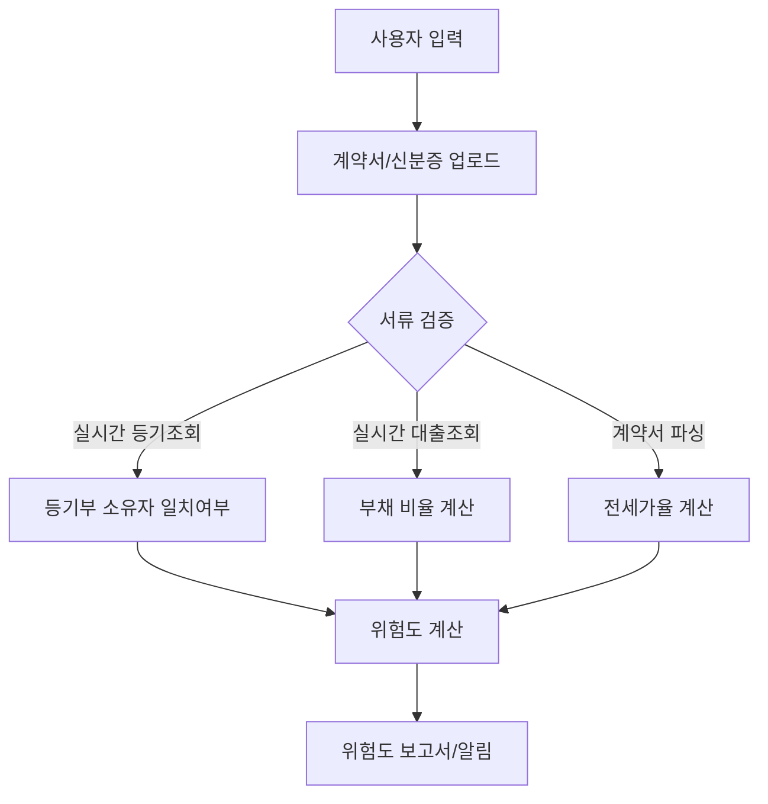

# 요약  
전세 사기 방지 시스템은 임대차 계약 전에 거래의 위험 신호를 사전에 감지하여 사용자에게 알리는 것을 목표로 합니다. 본 보고서에서는 (1) 계약자·임대인이 제출해야 할 서류와 제3자가 제공하는 자료, (2) 활용 가능한 데이터 소스, (3) 전세 사기 유형 및 실제 사례, (4) 위험도 산정 모델(지표, 정의, 가중치, 공식, 기준), (5) 시스템 아키텍처 및 데이터 흐름, (6) UI/UX 설계, (7) 오탐·미탐 방지와 검증 계획, (8) 단계별 로드맵 등을 다룹니다. 특히 **판별 로직의 논리적 타당성**을 강조하여, 컴퓨터공학적 관점에서도 충분히 신뢰할 수 있는 방식으로 설계합니다. 모든 기술적 내용은 최신 공공 데이터와 사례를 기반으로 하며, 국토교통부·대법원 등기소·행정안전부·금융감독원 등 공식 출처를 적극 활용하였습니다.  

## 1. 필요한 문서 목록 및 확인 절차  
임대차 계약 시 사용자(임차인)가 제출하거나 시스템이 확인해야 할 주요 서류는 다음과 같습니다(각 서류의 용도, 법적 근거, 검증 방법 포함).

- **전·월세 임대차계약서 (원본)** – 계약 내용을 기록하며, 확정일자 부여로 우선변제권을 확보하기 위해 필수입니다【3†L455-L456】【3†L458-L462】. *법적 근거*: 「주택임대차보호법」 제3조의 대항요건(확정일자) 및 「부동산 거래신고 등에 관한 법률」에 따른 거래신고. *검증 방법*: 문서 진위 확인(인감 날인, 공증 여부), 확정일자 플랫폼 또는 주민센터 납부 영수증 대조【3†L455-L456】.

- **임대인·임차인 신분증 및 주민등록등본** – 계약 당사자의 신분과 거주지를 확인합니다【19†L12-L18】. *법적 근거*: 주민등록법 및 「부동산등기법」(임차인의 대항요건, 임대인의 소유자 확인)【19†L12-L18】. *검증 방법*: 신분증 사진-실물 비교, 주민등록번호·이름 대조, 주민등록등본으로 주소 및 가족관계 확인. 임대인이 대리인인 경우 위임장·인감증명서 제출과 본인 확인을 병행합니다【19†L16-L18】.

- **부동산 등기사항증명서(등기부등본)** – 해당 주택의 소유자 및 권리관계(근저당·압류 등)를 확인합니다【19†L61-L69】. *법적 근거*: 「부동산등기법」(등기부는 공적 장부, 등기사항증명서 발급 근거)【19†L31-L39】. *검증 방법*: 등기소(인터넷등기소) 발급 데이터와 대조. *특히*: 단독·다가구주택은 토지등기부와 건물등기부의 소유자 일치 여부를 반드시 확인합니다【19†L66-L69】.

- **토지대장/건축물대장(필지·건물 대장)** – 건물·토지의 행정적 상태(전유면적, 용도지역 등) 확인. *법적 근거*: 「토지 관련 법령」 및 「건축물관리법」. *검증 방법*: 국토교통부 *건축물대장 API* 및 *토지임야정보 API* 등을 통해 조회【28†L123-L131】【30†L121-L129】.

- **전세보증금 납입증명서(은행 이체증 등)** – 임대차 보증금 입금 사실을 증명합니다. *검증 방법*: 제출된 영수증 상의 예금주와 계약자 일치 여부, 금액·날짜 대조.

- **주택소유권 이전 등기(최근 거래 이력)** – 임대인의 최근 매매 이력 등을 확인합니다. *법적 근거*: 부동산거래신고법에 따라 이전 시점 신고 의무. *검증 방법*: 등기부 이력 조회, 국토교통부 실거래가 데이터와 대조.

- **전세계약 신고확인서(전월세 신고제)** – 2021년 도입된 전월세 신고제 자료. *용도*: 동일 주택에 다중 계약 여부 파악. *검증 방법*: 국토교통부 실거래가 API 및 「전월세 신고 시스템」 확인.

- **HUG 전세보증금반환보증 가입내역** – (해당 시) 임대차보증금 반환보증 가입 여부 확인. *용도*: 보증 가입된 계약은 사기 위험 감소. *검증 방법*: 주택도시보증공사 데이터 조회 및 HUG 안전전세 앱 연동.

- **신용·대출 정보 (임대인 기준)** – 임대인의 대출잔액, 담보대출 비율, 연체 이력 등을 확인합니다. *법적 근거*: 「금융실명거래 및 비밀보장에 관한 법률」* 및 금융위원회 지침. *검증 방법*: 금융정보공유시스템, 신용정보원(KCB/NICE) 등을 통한 정보 조회【39†L59-L62】. 

다음 표는 주요 서류와 검증 절차를 정리한 것입니다.  

| 문서(자료)                 | 제출자      | 용도 및 검증                            | 법적 근거 (예시)                          |
|--------------------------|-----------|--------------------------------------|-----------------------------------------|
| **임대차계약서 (원본)**       | 임차인·임대인 | 계약조건 확인, 확정일자 확보 (우선변제권)【3†L455-L462】. 암호화·검증된 서명/인감, 공인중개사 확인서류로 진위 검증. | 「주택임대차보호법」(확정일자, 우선변제권), 부동산거래신고법 |
| **임대인/임차인 신분증**    | 임차인·임대인 | 계약 당사자 신분 확인. 주민등록증·운전면허 대조, 제3자 촬영 검사.  | 주민등록법, 민법(표시부동산 임대차)【19†L12-L18】        |
| **주민등록등본**            | 임대인     | 실제 주소·세대구성 확인. 계약자 일치 검증. | 주민등록법                              |
| **위임장·인감증명서**        | 임대인(대리인) | 대리 계약 시 제출. 전 화상통화·정부24 인감인증 연동 검증. | 민법(대리권, 인감법)【19†L16-L18】              |
| **등기사항증명서(등기부)**     | 시스템(API) | 소유권자 확인, 근저당·압류·가처분 내역 확인【19†L61-L69】. 주택 유형별(토지·건물) 일치 여부 점검【19†L66-L69】. | 부동산등기법                             |
| **토지대장/건축물대장**       | 시스템(API) | 건물면적·용도 등 물리정보 확인. 전용면적과 계약일치, 용도 변경 이력 파악. | 토지관련 법령, 건축법                       |
| **전세보증금 입금증명서**     | 임차인     | 보증금 납입 사실 증명. 은행 거래기록 대조.                | 민법(금전소비대차)                        |
| **전세계약 신고확인 자료**    | 시스템    | 동일 주택 대상 중복 신고 여부 확인.                    | 부동산거래신고법, 전월세신고제             |
| **HUG 보증가입 내역**      | 시스템/API  | 보증 가입 유무 조회(HUG 안전전세). 보증 가입은 사기 가능성 낮춤. | 주택도시보증공사법                       |
| **임대인 대출·신용 정보**    | 시스템(API)  | 임대인 대출금액, 근저당 비율, 연체 여부, 비제도권 금융 이용 등을 확인【39†L59-L62】. | 금융실명거래법, 금융위 지침               |

## 2. 활용 가능한 데이터 소스  
신뢰성과 접근성이 높은 공공·사설 데이터를 우선적으로 활용합니다. 주요 후보는 다음과 같습니다.

- **국토교통부 실거래가 정보 API** – 아파트·주택 매매·전월세 실거래 데이터를 제공합니다【12†L150-L158】. 건물 유형(아파트·연립·단독 등), 지역, 계약 일자 기준으로 조회 가능하며 실시간 갱신됩니다. *신뢰성*: 공신력 높은 공공데이터, 한국어 지원. *접근*: 공공데이터포털 API (XML/JSON)【12†L150-L158】. *주기*: 실시간 업데이트, 무료(공공누리)【12†L153-L160】.

- **국토교통부 건축물대장 정보 API (건축HUB)** – 건축물대장에 등록된 건물의 기본개요, 총괄표제부, 전유면적, 용도지역, 가격(주택가격) 등 속성정보 제공【28†L123-L131】【28†L150-L158】. *접근*: 공공데이터포털 API(REST)【28†L150-L158】, JSON/XML, 무료. *용도*: 계약 대상 건물의 구조·면적 대비 전세금 수준, 용도변경 여부 파악.

- **국토교통부 토지임야정보 API** – 지번별 토지·임야의 소재, 지목, 면적 등 정보를 제공합니다【30†L121-L129】【30†L148-L156】. 소유자 개인정보는 제외되어 있으나, 지적정보 확인에 유용합니다. *접근*: VWorld 서비스 REST API【30†L150-L158】, JSON/XML, 실시간. *용도*: 토지 면적 대비 전세금 비율 분석, 용도(전답·대지 등) 파악.

- **법원 등기정보(인터넷등기소) 및 API** – *대법원 인터넷등기소*에서 등기사항증명서 열람(소유자, 저당권 내역 등)을 할 수 있습니다. *접근*: 인터넷등기소 웹/휴대폰(개인) 또는 제휴 CODEF* API(법인등기부) 사용. *용도*: 소유주와 계약자 불일치 여부, 선순위 근저당권 존재 유무 확인.

- **행정안전부 부동산 종합정보** – 지방자치단체(시군구)에서 제공하는 토지/건물 정보를 활용할 수 있습니다. *예*: 부동산대장(토지·건축물), 지적도(토지조서) 등. API는 부족하나, *행안부 주소코드 API* 등을 통해 주소 정규화 및 코드 변환 가능.

- **주택도시보증공사(HUG) 데이터** – *전세보증금반환보증 가입현황*【25†L119-L127】 등 분기별 실적 데이터를 활용하여, 특정 지역·유형의 보증 가입률 및 사고 발생 추이 파악. 또한 *HUG 안전전세 포털*은 위험사례 데이터를 제공하므로 위험 경고에 활용합니다.

- **금융정보(신용·대출)** – *한국신용정보원·KCB/NICE* 등 신용조회 기관의 정보를 통해 임대인의 신용점수 및 대출현황(전세자금대출 포함)을 확인할 수 있습니다. *금융감독원 공공데이터* 포털에서는 일부 대출·금리 정보를 제공합니다【26†L1-L4】. *용도*: 임대인의 과도한 부채, 연체·연체율, 비제도권 금융 이용 여부 판단.

- **통계지리정보서비스(SGIS) 및 공공지도** – 통계청·국토부 등의 GIS(통계·지적) API로 주소에 따른 시군구 평균 전세가율, 주변 시세 등을 조회하여 가격 이상치 탐지에 활용합니다.

- **공인중개사·법무사 포털 정보** – 공인중개사 자격 확인, 중개보수 내역 조회(공인중개사협회), 법무사 계약 관리 시스템 등이 보조 소스로 사용될 수 있습니다.

아래 표는 주요 데이터 소스의 특성을 비교한 예시입니다.

| 소스              | 제공기관            | 데이터 유형                   | 접근 방식      | 갱신주기            | 라이선스/언어     |
|-----------------|----------------|--------------------------|-------------|----------------|---------------|
| 국토부 실거래가API【12†L150-L158】 | 국토교통부        | 부동산 실거래가 (매매/전월세)     | 공공API (REST) | 실시간 업데이트     | 무료 (공공누리, 한글) |
| 국토부 건축물대장API【28†L123-L131】 | 국토교통부        | 건축물대장 속성정보             | 공공API (REST) | 실시간           | 무료, 한글        |
| 국토부 토지임야API【30†L121-L129】 | 국토교통부        | 토지·임야 속성정보             | 공공API (링크) | 실시간           | 무료, 한글        |
| 대법원 등기정보    | 대법원 (인터넷등기소) | 토지/건물 등기사항증명       | 웹/제휴API    | 수시 (관리정보)      | 무료(열람수수료), 한글 |
| 행안부 전입세대API | 행정안전부         | 전입·전출세대 정보            | 공공API (REST) | 실시간           | 무료, 한글        |
| HUG 전세보증실적【25†L119-L127】 | 주택도시보증공사     | 보증 가입·사고 실적 데이터      | 공공CSV/API   | 분기별           | 무료, 한글        |
| 신용·대출정보      | 신용정보원/KCB/NICE | 임대인 신용·대출 기록         | 제휴 API      | 실시간 (개인동의 시) | 비공개, 한글    |
| SGIS 통계지리API   | 통계청 등           | 시군구별 주택가격지수 등 통계     | 공공API       | 수시 업데이트      | 무료, 한글        |
| 부동산 플랫폼     | 민간(예: KB국민은행) | 실거래가 시세 정보, 시세지도    | 웹스크래핑 등  | 수시            | 제한적 사용 가능  |

## 3. 전세 사기 유형 및 사례  
전세 사기는 다양한 방식으로 발생하며, 주요 유형과 사례는 다음과 같습니다. 

- **깡통전세(무자본 갭투자형)** – 임대인이 자기자본 없이 은행 대출과 전세보증금으로 집을 구입한 후, 보증금 반환 능력이 없어지는 경우입니다. *사례*: 2023년 4월 경기 광주에서 임대업자 110명을 대상으로 1,230억 원대 전세보증금을 편취한 사건(징역 15년)에서, 피고인들은 선순위 근저당권 말소나 감액을 약속하거나 신탁제도를 왜곡 설명하여 세입자를 기만했습니다【8†L205-L213】. 이는 임대인이 자본 없이 갭투자로 주택을 매입하고 보증금을 돌려줄 재원을 확보하지 못해 발생한 전형적인 깡통전세 사례입니다.

- **이중·삼중 계약** – 동일 부동산에 두 명 이상의 임차인과 계약을 체결하고, 후순위 임차인에게 보증금을 돌려주지 않는 사기입니다【8†L171-L179】. 예를 들어, 임대인이 두 차례에 걸쳐 같은 주택에 전세계약을 하고 한 계약만 유효하다고 속이거나, 중개사가 월세를 전세로 속여 계약하는 방식 등이 있습니다. 서울시의 AI 분석 서비스 예시에서는 다가구 주택의 *선순위 보증금 규모 예측* 기능을 제공했는데, 동일 건물에서 누가 먼저 들어왔는지에 따라 나중 세입자의 피해가 달라집니다【54†L13-L16】.

- **허위 임차인 이용** – 임대인이 거짓 세입자를 등장시켜 금융기관으로부터 대출을 받거나, 전입신고·확정일자를 받아 보증금을 편취합니다. 신탁을 이용하는 경우도 포함됩니다. 법률신문 판례에 따르면, 임대인이 “관리신탁” 등을 미끼로 허위 설명하여 보증금을 편취한 사례가 빈번히 다뤄졌습니다【8†L205-L213】【8†L212-L214】.

- **계약 후 대출 실행** – 임차인이 전입신고·확정일자를 받은 당일 임대인이 은행에서 추가 대출을 받거나 가압류를 설정하여, 우선변제권을 무력화하는 경우입니다【36†L117-L122】. 예를 들어, 임대인이 계약 당일 자산이 거의 없는 제3자에게 소유권을 넘기고 당일 대출을 실행하여 집이 경매로 넘어간 사례가 보고되었습니다【36†L119-L122】.

- **권리 관계 기만(신탁오도 등)** – 토지신탁이나 근저당순위 등 권리관계를 은폐·왜곡하는 수법입니다. 신탁 등기의 의미를 세입자에게 잘못 설명하거나, 선순위 저당권(근저당권) 규모를 축소 고지하는 유형이 많습니다【8†L205-L213】. 법원은 이러한 기망행위의 존재 여부에 따라 사기죄 성립 여부를 엄격히 판단하고 있습니다【8†L173-L182】. 

- **기타 유형**: 허위 건물 표시(아파트 실제 등기번호와 다른 호수로 계약), 공인중개사 사기(모두 계약 후에야 권리분석 결함 발견) 등이 있습니다【19†L65-L69】【36†L107-L111】.

아래는 주요 판례·사례 예시입니다:

- **경기 광주 빌라 123억 사기 (2023)** – 임대인이 “신탁관리”로 속여 가며 다수의 임대차 계약을 체결하고, 선순위 담보 설정 약속을 이행하지 않아 110명에게 123억 원을 편취한 사건【8†L205-L213】. 피고인은 적극적인 기망 수법으로 유죄(징역 15년)를 받았고, 사기 유형에 명확하게 해당함이 입증되었습니다.

- **수원지법 성남지원 무자본 갭투자형 (2023)** – 임대인이 다수 부동산을 근저당 설정 상태로 보유하여 실재 소유 가치가 사실상 없었고, 계약 당시에도 보증금 반환 능력이 없다고 볼 수 있는 사안【8†L221-L227】. 대출 이자 부담이 크고 추가 소득 수단이 없었음에도 전세받은 점 등을 근거로 법원은 임대인의 *미필적 고의(implicit intent)*를 인정하지 않고 형을 경감하여 징역 1년을 선고했습니다.

- **신축 빌라 브로커 공모 사례** – 건축주와 브로커가 공모하여 보증금 반환 능력이 없는 가명인에게 빌라를 매도한 뒤, 고액 전세계약을 체결하고 반환을 어렵게 한 사건【36†L109-L111】. 이와 같은 *매매 후 세입자 유인형* 사기는 계약 완료 후에야 피해가 드러나 법적 대응이 어려운 경우입니다.

이상의 사례와 판례【8†L171-L179】【36†L107-L111】를 토대로, 전세 사기 위험 신호로는 **임대인의 과도한 부채 또는 근저당 설정, 다중 계약 기록, 계약 당일 대출 실행 내역, 계약금액 대비 지나친 전세가율, 임대인 정보와 등기부 정보 불일치** 등이 꼽힙니다.

## 4. 위험도 산정 모델  
전세 거래 건별 위험도를 평가하기 위해 **지표 기반 점수화 모델**을 설계합니다. 주요 위험 지표(피처)와 정의, 가중치(예시), 산식, 임계값 예시는 다음과 같습니다.

### 후보 지표 (Indicator) 및 설명  
1. **임대인 부채·근저당 비율 (Mortgage Ratio)** – *정의*: 임대인이 설정한 근저당 총액을 부동산 시가(실거래가)로 나눈 비율. *단위*: %. *설명*: 높을수록 보증금 반환 능력 저하.  
2. **임대인 대출 이자율 수준** – *정의*: 임대인의 전세자금대출 등 주요 대출 이자율(%). *설명*: 금리가 높으면 이자 부담이 커서 상환능력 감소 신호.  
3. **임대인 연체 이력** – *정의*: 최근 2년 내 금융 연체 기록 유무(없음=0, 1~2회=1, 3회 이상=2). *설명*: 연체 이력은 책임 회피 가능성 증가.  
4. **비제도권 금융 이용 여부** – *정의*: 임대인이 제도권 외 사금융 이용 이력(없음=0, 있음=2). *설명*: 고금리 사금융 이용자는 자금 압박이 크고 위험도가 높음【39†L59-L62】.  
5. **다중 계약·보증금 존재 여부** – *정의*: 해당 부동산에 이전 등록된 전세 보증금(선순위·동시계약) 유무 (없음=0, 있음=1). *설명*: 선순위 보증금이 있거나 중복 계약 기록이 있으면 충돌 위험. *자료*: 전월세 신고 시스템, HUG 데이터, 지방자치 계약 신고자료.  
6. **전세가율(가격 이상치)** – *정의*: `(전세보증금 ÷ 공시가격 또는 실거래가)` 비율. 통상 70~80%를 초과하면 이상치로 간주. *설명*: 지나치게 높은 전세가율은 사기 위험 신호.  
7. **소유자 정보 불일치** – *정의*: 계약서상의 임대인 정보(이름·주민번호)가 등기부상 소유자와 동일한지 여부(일치=0, 불일치=1). *설명*: 불일치하면 위임계약 또는 문서 위조 가능성.  
8. **임대인 연락처 신뢰도** – *정의*: 임대인의 휴대전화 번호가 정상 등록된지, 금융거래와 일치하는지 여부(정상=0, 불량/미등록=1). *설명*: 의심 번호나 번호 없음은 신뢰도 하락.  
9. **계약서 문구 이상** – *정의*: 계약서에 기재된 특약·조항의 이상 유무(표준양식 사용=0, 의심 조항 삽입=1). *설명*: 예를 들어, 특약에 전세보증금 반환 면제 조항 등이 들어 있으면 위험.

### 점수화 모델 및 공식  
각 지표에 가중치를 부여하여 종합 점수를 계산합니다. 예를 들어 다음과 같은 가중치 비율을 적용할 수 있습니다(총합 100점 기준):

- 부채·근저당 비율: 20%  
- 대출 이자율: 10%  
- 연체 이력: 15%  
- 비제도금융: 15%  
- 다중 계약/선순위: 20%  
- 전세가율: 10%  
- 소유자 불일치: 5%  
- 연락처 이상: 3%  
- 계약서 조항: 2%  

각 지표별 점수($S_i$)는 해당 상태에 따라 정규화된 값(예: 0~100)으로 환산합니다. 예를 들어 **부채 비율**이 80%라면 높은 위험(예: 점수 80점), 30%라면 낮은 위험(점수 30점) 등으로 매핑할 수 있습니다. 점수 산식 예시는 다음과 같습니다.

\[
\text{위험점수} = \sum_i w_i \times S_i \quad (\text{단, } \sum_i w_i = 1)
\]

여기서 $w_i$는 지표별 가중치, $S_i$는 해당 지표의 위험 점수(0–100)를 백분율로 환산한 값입니다. 가령 **다중 계약/선순위** 지표에서 이상이 발견되면(있음=1) $S=100$, 없으면 $S=0$로 설정할 수 있습니다. 점수 분포에 따른 위험 구간은 예를 들어 다음과 같이 구분할 수 있습니다:

- **고위험**: 종합 점수 ≥ 70 (예: 사기 가능성 높음)  
- **주의**: 40 ≤ 점수 < 70 (의심 요인 다수)  
- **정상**: 점수 < 40 (사기 가능성 낮음)  

위 규칙은 상황에 맞게 조정될 수 있으며, **설명 가능성**(Explainability)을 위해 각 지표의 위험도 기여도를 사용자에게 제시합니다. 예컨대, **임대인의 부채 비율 90%**라는 경고와 함께 “높은 근저당 비율로 반환 능력 우려”라고 안내합니다. 또한 AI 모델 연구에 따르면, 전세사기 위험은 *물리적 주택 특성보다 임대인의 금융 상태* (대출 규모·이자·연체·비제도금융)이 핵심 변수임이 확인되었습니다【39†L59-L62】. 따라서 금융 지표에 높은 가중치를 두어야 합니다.

아래 예시는 위험 지표와 대응 점수를 정리한 표입니다.

| 지표                  | 설명                                  | 측정 예시                          | 가중치(%) | 점수 부여 기준        |
|---------------------|-------------------------------------|----------------------------------|---------|--------------------|
| 부채·근저당 비율          | 부동산 시가 대비 근저당 총액 비율              | (근저당총액/실거래가)×100%         | 20      | ≥80%→100점, 50%→60점, ≤20%→0점 |
| 임대인 대출 이자율       | 주요 대출의 이자율 수준                      | 주택담보대출 금리 (연 %)          | 10      | ≥6%→100점, 3%→50점, ≤1%→0점   |
| 연체 이력              | 최근 연체 건수                            | 연체 없음=0, 1~2회=1, 3회 이상=2 | 15      | 2건 이상→100점, 없음→0점   |
| 비제도권 금융 이용      | 제도권 외 사금융 이용 여부                 | 예/아니오                      | 15      | 있음=100점, 없음=0점      |
| 다중 계약/선순위 존재    | 기존 임대차 계약자(선순위 보증금) 존재 여부    | 예=1, 아니오=0               | 20      | 있음=100점, 없음=0점      |
| 전세가율 이상 여부      | 전세금/시가 비율                          | (전세금/공시가)×100%           | 10      | ≥85%→100점, 70%→50점, ≤50%→0점 |
| 소유자 정보 불일치      | 계약자 vs 등기부 소유자 불일치 여부           | 일치/불일치                   | 5       | 불일치=100점, 일치=0점     |
| 연락처 이상            | 휴대전화 불량(검증불가) 여부                | 정상/불량                    | 3       | 불량=100점, 정상=0점      |
| 계약서 이상 조항       | 특약 등 비정상 조항 존재 여부               | 예/아니오                      | 2       | 있음=100점, 없음=0점      |

개별 지표 점수를 반영하여 총점(0–100)을 산출하고, 임계값을 넘는 경우 사용자에게 *경고* 또는 *주의 알림*을 제공합니다. 예를 들어 점수가 75점 이상이라면 “고위험”으로 분류하여 거래 자제 또는 전문가 상담을 권고하고, 40–74점은 “주의”로 낮은 우선순위지만 추가 확인 권고, 40점 미만은 “정상”으로 판단할 수 있습니다. 

## 5. 시스템 아키텍처 및 데이터 파이프라인  
시스템은 웹 서버와 백엔드, 데이터 저장소, 외부 연동 모듈 등으로 구성합니다. 주요 구성 요소는 다음과 같습니다:

```mermaid
graph LR
    subgraph 사용자 인터페이스
        UI[웹/앱 화면]
    end
    subgraph 백엔드/서버
        API_GW[API Gateway]
        Service[응용 서버 (검증 & 점수화)]
        DB[(DB: 임대인·물건 정보)]
        Audit[(로깅·감사)]
        Model[위험도 모델]
    end
    subgraph 외부 시스템
        MolitAPI[MOLIT 공공API] 
        EgisAPI[등기소 API] 
        CreditAPI[신용조회 API] 
        HUGAPI[HUG 보증정보 API]
    end

    UI --> API_GW
    API_GW --> Service
    Service --> MolitAPI
    Service --> EgisAPI
    Service --> CreditAPI
    Service --> HUGAPI
    Service --> DB
    Service --> Model
    Model --> DB
    Service --> Audit
```

- **데이터 수집/정제**: 계약서 OCR 처리, 사용자 입력값 정규화(주소, 숫자 등) 후 데이터 저장소에 기록합니다. 외부 데이터(MOLIT, 등기, 신용 등)는 캐시/배치 또는 실시간 API 호출 방식으로 수집해 DB에 축적합니다. *업데이트 방식*: 실시간 API가 가능한 실거래가·건축물대장은 호출 시점 즉시 조회하며, 변경이 잦지 않은 등기·토지정보는 주기적 배치로 최신화를 유지합니다.

- **실시간 검증 vs 배치 처리**: 사용자가 입력한 계약 정보를 **실시간**으로 즉시 검증합니다. 예를 들어, 주소 입력 시 MOLIT 실거래가와 비교하여 전세가율 경고, 계약서 제출 시 등기부 확인, 임대인 신분증 제출 시 등기소 정보 일치 여부를 검증합니다. 반면, 일괄 분석(배치)은 새로운 데이터 소스 등록, 주기적 위험도 모델 학습 업데이트에 사용합니다.

- **API 연동**: MOLIT 실거래가・건축물대장・토지정보 API, 대법원 등기정보(개인 휴대폰 인증 또는 제휴 API), 신용조회 API 등을 활용합니다. 각 호출 기록은 감사 로그에 저장하여 누가 언제 어떤 데이터를 조회했는지 추적합니다.  

- **개인정보 보호**: 개인정보처리 방침과 「개인정보보호법」, 「가명정보」 가이드라인에 따라 임대인·임차인 개인정보를 암호화 또는 가명 처리하여 저장합니다. 주민번호 같은 민감정보는 전송하지 않고 시스템 내에서 비교용 해시값(예: SHA-256)만 사용합니다. 모든 데이터 전송은 SSL/TLS로 암호화하며, 내부 DB 접근은 권한 최소화로 안전하게 설계합니다.

- **로깅 및 감사**: 모든 계약 정보 입력, 데이터 조회, 위험도 산정 결과 등을 로그로 남깁니다. 특히 높은 위험 판단 시에는 근거가 된 데이터(예: 등기부 번호, 계약서 특정 조항 등)를 함께 기록하여 투명성을 확보합니다. 이력 데이터는 법적 분쟁 시 감사자료로도 활용됩니다. 

- **시스템 구성 예시**: 웹 서버(프론트엔드)+애플리케이션 서버(비즈니스 로직) + DB 서버 + 별도의 AI/분석 서버로 구성합니다. 필요한 경우 마이크로서비스 패턴을 적용하여 등기조회, 신용조회, 점수계산 모듈을 독립된 서비스로 배포할 수 있습니다.

## 6. UI/UX 설계 및 위험 보고서  
사용자 인터페이스는 간단명료하되 필요한 정보를 충분히 반영합니다. 흐름은 다음과 같습니다:

1. **초기 입력 화면**: 임차인은 주택 주소, 계약 금액, 계약일 등 기본 정보를 입력합니다. 주소 입력 시 자동 완성 기능과 지오코딩으로 정확한 시군구/법정동을 매칭합니다.  
2. **계약서 및 신분증 업로드**: 임대차계약서(스캔 PDF)와 임차인·임대인 신분증 사진을 업로드하도록 안내합니다. OCR과 바코드 인식을 통해 계약서 정보를 자동 추출할 수도 있습니다.  
3. **검증 진행 및 알림**: “검증 시작” 버튼 클릭 시 백엔드에서 등기부 확인, 대출 조회, 전세가율 계산 등을 수행합니다. 사용자에게는 처리 중 진행 바를 보여주며, 주요 위험 발견 시 팝업 알림(예: “이 계약서는 등기부 소유자와 대조 중”)을 표시합니다.  
4. **위험 분석 결과**: 분석 완료 후 종합 위험 점수와 함께 **위험 요소별 상세 리포트**를 테이블로 제공합니다. 예를 들어 다음과 같은 형식입니다:

| 위험 요소             | 내용                                         | 점수 기여도 | 평가 결과        |
|---------------------|-------------------------------------------|-----------|---------------|
| **근저당 비율**        | 근저당 설정액 90% (고위험)                       | 20 (가중치)  | 위험 (높음)      |
| **다중 계약 존재**      | 기존 선순위 보증금 확인(30백만원) 존재                | 20          | 위험 (매우 높음)  |
| **전세가율**          | 공시지가 대비 전세가율 85% (높음)                | 10          | 위험 (매우 높음)  |
| **임대인 연체 이력**    | 최근 연체 기록 2건                                 | 15          | 위험 (중간)      |
| **부동산 등기 일치 여부** | 임대인 정보 일치(정상)                            | 5           | 정상            |
| **계약 특약 이상**     | 특약 없음 (표준 계약서)                            | 2           | 정상            |
| **총점**              | *- 합산 점수* (70점, 고위험)                   | –         | **고위험 판단**   |

위 예시에서 각 요소별 설명과 점수, 위험 등급을 한눈에 볼 수 있도록 하며, “고위험”일 경우 빨간색으로 강조합니다. 사용자는 보고서 내용을 기반으로 전문가 상담, 계약 재검토 등의 추가 조치를 검토할 수 있습니다. 또한 위험 점수 분포를 직관적으로 보여주기 위해 막대그래프나 게이지 차트 형태의 시각화도 제공합니다(아래 예시 참고).



## 7. 구현 리스크 및 검증 계획  
시스템 구현 시 고려할 위험과 대응 방안은 다음과 같습니다:

- **오탐(False Positive)**: 정상 거래가 과도한 위험점수로 분류될 수 있습니다. 예를 들어 고액 전세라도 임대인이 자산이 충분하면 사기 아님에도 높은 점수를 받을 수 있습니다. 이를 완화하기 위해 모델 학습 시 정상 거래 데이터도 충분히 반영하여 경계 기준을 조정합니다. 또한 사용자에게 “위험 원인”을 명확히 제시하여 임대인 설명 등을 통해 해명할 기회를 제공합니다.  

- **미탐(False Negative)**: 교묘한 사기 패턴은 탐지하지 못할 수 있습니다. 특히 가명 사용, 비제도 금융 내역 부정확 기록 등은 놓치기 쉽습니다. 주기적으로 실제 사기 사례 DB(경찰·법원자료)를 업데이트하고, ML 모형(예: 전술한 AI 시범 모델)과 병용하여 성능을 검증합니다.

- **데이터 불일치 및 누락**: 공개 데이터와 실제 정보가 시차나 오류로 맞지 않을 수 있습니다. 이를 위해 계약 이전 최종 업데이트 날짜를 명시하고, 의심스러운 경우 사용자가 직접 추가 자료(예: 공인중개사 확인서) 제출을 요청하도록 설계합니다. 또한 데이터 제공처와의 협업을 통해 최신성 확보(예: 대법원 등기정보 연동 검토)를 추진합니다.

- **개인정보 유출 위험**: 계약서, 주민번호 등 민감정보를 처리하기 때문에 보안이 핵심입니다. 앞서 언급한 암호화·가명처리 외에도 정기적인 보안 감사, 접근권한 관리, 개인정보 영향평가(PIA) 등을 실시합니다.  

- **사용자 신뢰도 저하**: 위험 판정 오류 시 서비스에 대한 신뢰가 떨어질 수 있습니다. 해석 가능한 설명 제공과 함께 “오류 신고” 기능을 두어 지속 개선합니다.

- **검증 및 테스트 계획**: 
  1) **단위/통합 테스트**: 각 API 연동 모듈, DB 스키마, UI 흐름에 대한 기능 테스트 수행.  
  2) **케이스 기반 시뮬레이션**: 알려진 사기 사례(경찰 또는 법원 판결 기반)와 정상 계약 사례를 데이터로 시뮬레이션하여 모델 성능(민감도·특이도)을 측정합니다.  
  3) **사용자 검증 테스트**: 베타 테스트를 통해 실제 예비 임차인들에게 시스템 사용을 허용하고, 시스템 예측과 실제 거래 결과(문제 발생 여부)를 비교 분석합니다.  
  4) **피드백 루프**: 이상 징후 탐지 후 실제 사기 여부를 추적하여 알고리즘을 지속 보완합니다. 법적 사건 발생 시 내부 DB로 사례를 축적하여 모형 재학습에 활용할 수 있습니다.  

## 8. 단계별 로드맵 및 MVP  
실제 구현은 우선순위에 따라 단계적으로 진행합니다. 예산·인력 제한을 가정할 때 MVP(핵심 기능 우선 개발)와 그 이후 확장 계획은 다음과 같습니다:

1. **준비 단계 (1개월)**: 요구사항 명세, 데이터 소스 확보(공공API 신청, 제휴 논의), 기본 시스템 아키텍처 설계.  
2. **1단계 MVP (2~3개월)**: 
   - *자료 입력/검증 기능*: 사용자의 주소·계약금 입력 및 계약서/신분증 업로드 UI 개발.  
   - *기본 서류 검증*: 등기부등본 조회, 실거래가 비교(전세가율 계산), 주민등록(본인확인) 검증 기능 구현.  
   - *위험도 산정 엔진*: 부채 비율·전세가율 등 기초 지표로 간단한 점수 계산 모듈.  
   - *결과 리포팅*: 위험점수 계산 및 요약 보고서 출력, 메일/푸시 알림 연동.  
   - *보안·로그*: 개인정보 암호화 저장, 로그 시스템 구축.  

3. **2단계 기능 확장 (3~4개월)**: 
   - 추가 데이터 연동: MOLIT 건축물대장, 토지정보 API 연동. 대법원 등기정보 API(제휴)와 신용조회 API 연동.  
   - 정교한 위험도 모델: 머신러닝 모델 도입(위 AI 시범연구 결과 활용) 및 지표별 가중치 최적화.  
   - UI 고도화: 대시보드 형태 위험도 차트 및 안내 메시지 강화, 모바일 최적화.  
   - 관리자 모드: 케이스 모니터링, 거짓 긍정/부정 관리용 내부 인터페이스 개발.

4. **3단계 안정화 및 배포 (2~3개월)**: 
   - 베타 테스트를 통한 버그 수정 및 성능 개선.  
   - 서비스 운영 환경 구축(클라우드 배포, 스케일링).  
   - 법률·컴플라이언스 검토: 개인정보영향평가 완료, 내부 보안심사 통과.  
   - 론칭 및 마케팅: 사용자 교육 자료, 고객센터 준비.  

**예상 인력 및 일정 예시**: 4명 규모 팀(프론트 개발자, 백엔드 개발자, 데이터 엔지니어, 기획/법무 담당)이 매주 1회 스프린트 회의를 통해 개발하며, 전체 예상 기간은 약 6~8개월입니다. 각 단계별 산출물(프로토타입, 테스트 보고서, 최종 시스템)을 관리하여 진척도를 모니터링합니다.

위 계획은 팀 규모나 예산 상황에 따라 유연하게 조정할 수 있습니다. 핵심은 **1단계 MVP**에서 위험 검증 로직을 작동시키고 사용자에게 의미 있는 리포트를 제공하는 것이며, 이후 단계에서 고도화 및 확장으로 이어지도록 하는 것입니다.

**참고 문헌·출처:** 본 보고서의 내용은 주택임대차 관련 생활법령정보【19†L61-L69】【19†L12-L18】, 국토교통부·HUG 공공데이터【12†L150-L158】【28†L123-L131】【30†L121-L129】【25†L119-L127】, 법률신문 판례 해설【8†L171-L179】【8†L205-L213】, 정부 보도자료【36†L107-L111】【39†L59-L62】 등을 근거로 작성되었습니다.