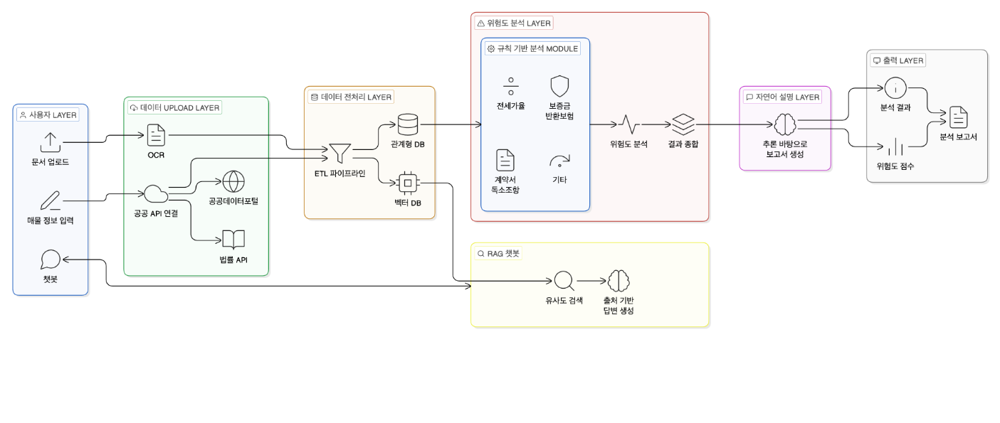

# 제목
AI 기반 전세사기 위험도 분석 및 법률 지식 지원 시스템
## 개요
### GitHub Url
https://github.com/cyunchaeskku/capstone_jeonse-risk-analysis-ai

### 팀원
2019321493 최윤채

### 지도교수
한환수 교수님

## 1. 과제의 필요성
Abstract

최근 국내 전세 시장에서는 전세사기 피해가 지속적으로 증가하며 심각한 사회 문제로 대두되고 있습니다. 전세사기는 계약 체결 이전 단계에서 위험을 인지하기 어렵고, 다양한 정보의 종합적 판단이 요구되는 특징을 가지고 있습니다. 그러나 현재의 예방 방식은 파편적 지식에 의존한 단편적 검토에 불과하며, 일반 사용자가 이를 종합적으로 해석하기에는 한계가 존재합니다.
본 작품은 이러한 문제를 해결하기 위해 전세계약과 관련된 정형 및 비정형 데이터를 통합적으로 분석하고, 사전에 정의된 규칙과 대규모 언어모델(LLM)의 추론 능력을 활용하여 전세사기 위험도를 판단하는 시스템을 설계하는 것을 목표로 합니다. 또한 법률 및 판례 데이터를 기반으로 한 RAG(Retrieval-Augmented Generation) 챗봇을 통해 사용자에게 근거 기반 정보를 제공함으로써, 실제 계약 과정에서 활용 가능한 의사결정 지원 도구를 구현하고자 합니다.

서론

최근 전세사기는 개별적인 범죄를 넘어 구조적인 사회 문제로 확산되고 있습니다. 전세사기 피해는 지속적으로 누적되고 있으며, 특히 청년층과 사회초년생 등 상대적으로 정보 접근성과 자산 여력이 부족한 계층에 피해가 집중되는 경향을 보이고 있습니다. 이는 단순한 개인 재산 피해를 넘어 사회적 비용 증가로 이어지는 중요한 문제입니다.
정부는 전세사기 피해자 보호를 위해 다양한 정책을 시행하고 있으나, 이러한 대응은 대부분 피해 발생 이후의 사후 대응에 초점을 맞추고 있습니다. 실제로 피해자 지원 제도, 주거 지원, 금융 지원 등은 일정 부분 효과를 보이고 있으나, 계약 체결 이전 단계에서 위험을 사전에 방지하는 기능은 여전히 충분하지 않은 상황입니다. 따라서 전세사기 문제 해결을 위해서는 사후 대응이 아닌 사전 예방 중심의 접근이 필요합니다.
전세사기의 핵심적인 문제는 계약 체결 이전 단계에서 위험을 충분히 인지하기 어렵다는 점입니다. 전세사기는 깡통전세, 이중계약, 허위 임대인, 서류 위조 등 다양한 형태로 발생하며, 이러한 위험 요소는 단일 요인이 아니라 여러 조건이 복합적으로 작용하여 나타납니다. 예를 들어 전세가율이 높고 근저당이 과다하게 설정된 경우, 집값 하락 시 보증금 반환이 어려워질 가능성이 높아집니다. 또한 등기부등본상의 권리관계나 계약서 내 특약사항과 같은 정보는 단순 확인만으로는 위험 여부를 판단하기 어렵고, 해석 과정에서 일정 수준 이상의 전문 지식이 요구됩니다.
현재 전세사기 예방을 위해 제공되는 정보와 가이드라인은 인터넷을 통해 접근할 수 있으며, 체크리스트 형태의 점검 자료나 관련 지식을 참고하여 계약 전 확인을 수행하는 방식이 일반적으로 활용되고 있습니다. 이러한 방식은 기본적인 점검 기준을 제공한다는 점에서 유용하지만, 실제로는 사용자가 인터넷에 분산되어 있는 정보나 단편적인 지식에 의존하여 판단을 내려야 하는 구조로 이루어져 있습니다.
이러한 구조에서는 사용자가 다양한 정보를 직접 수집하고 이를 종합적으로 해석해야 하며, 이는 부동산 및 법률 지식이 부족한 일반 사용자에게 큰 부담으로 작용합니다. 특히 계약 과정은 제한된 시간 내에 이루어지는 경우가 많기 때문에, 충분한 검토 없이 의사결정이 이루어질 가능성이 높습니다. 결과적으로 현재의 전세사기 예방 구조는 정보는 존재하지만 이를 효과적으로 활용하기 어려운 상태라고 볼 수 있습니다.
전세사기 위험 판단 문제는 다양한 형태의 데이터를 동시에 고려해야 하는 복합적인 문제입니다. 실거래가, 공시가격, 대출 정보와 같은 정형 데이터뿐만 아니라 계약서, 등기부등본, 건축물대장과 같은 비정형 문서 데이터가 함께 활용됩니다. 특히 계약서에는 특약 조항이나 불리한 조건이 포함될 수 있으며, 등기부등본에는 권리관계와 관련된 중요한 정보가 포함되어 있습니다. 이러한 비정형 문서는 단순 조회가 아닌 해석이 필요한 데이터이며, 사용자 입장에서 이해하기 어려운 경우가 많습니다.
따라서 전세사기 예방 문제는 단순한 정보 제공의 문제가 아니라, 다양한 데이터를 종합적으로 해석하고 판단을 지원하는 문제로 정의할 수 있습니다. 본 작품에서는 이러한 문제를 해결하기 위해 사전에 정의된 규칙을 기반으로 다양한 위험 요소를 구조화하고, 대규모 언어모델의 추론 능력을 활용하여 사용자 상황에 맞는 위험 판단을 제공하는 접근 방식을 적용합니다. 또한 법률 및 판례 데이터를 기반으로 한 RAG 챗봇을 통해 사용자 질문에 대해 근거 기반의 답변을 제공함으로써, 단순 정보 제공을 넘어 실제 의사결정을 지원하는 기능을 구현하고자 합니다.
결론적으로 본 작품은 전세사기 문제를 정보 부족의 문제가 아니라 정보 해석의 문제로 보고, 이를 해결하기 위한 시스템을 구현하는 데 목적이 있습니다. 이는 기존의 단편적인 체크리스트 기반 접근 방식의 한계를 보완하고, 사용자 중심의 실질적인 전세사기 예방 도구를 제공한다는 점에서 의의를 가집니다.

## 2. 선행연구 및 기술현황
전세사기는 사회적 문제로 확산됨에 따라 그 발생 원인과 예방 방안에 대한 다양한 연구가 이루어지고 있습니다. 대표적으로 강민채, 안정빈(2024)의 「전세사기의 발생원인과 대응방안에 관한 연구」, 김진유, 권혁신(2024)의 「전세사기 예방을 위한 제도 개선방안 연구」, 김재필(2025)의 「전세사기 발생원인에 관한 연구」, 박규화(2025)의 전세보증금 미반환 및 피해 사례 연구 등 다수의 연구가 전세사기의 구조적 원인과 대응 방안을 분석하고 있습니다.
이들 연구를 종합하면, 전세사기의 주요 원인은 임대인과 임차인 간의 정보 비대칭, 임차인의 권리 보호 미흡, 그리고 기관 간 정보 공유 부족으로 나타나고 있습니다. 특히 계약 당사자 간 정보 비대칭은 전세사기의 핵심 원인으로 지목되며, 임차인이 해당 부동산의 권리관계, 담보 상태, 임대인의 재무 상태 등을 충분히 파악하기 어려운 구조가 문제로 지적되고 있습니다.
또한 전세사기는 단일 요인이 아닌, 주택 가격 변동, 과도한 대출, 갭투자 구조, 근저당 설정 등의 복합적인 요인이 결합되어 발생하는 구조적 문제로 분석됩니다. 이러한 특징으로 인해 단순한 정보 제공이나 개별 항목 확인만으로는 전세사기를 예방하기 어렵다는 점이 공통적으로 지적되고 있습니다.
기존 연구들은 이러한 문제를 해결하기 위해 전세권 설정 의무화, 정보 공개 확대, 공인중개사 책임 강화, 전세가율 제한 등 다양한 제도적 개선 방안을 제시하고 있습니다. 그러나 이러한 접근은 주로 정책 및 제도 중심으로 이루어져 있으며, 실제 계약 과정에서 사용자가 직접 활용할 수 있는 실질적인 도구에 대한 연구는 상대적으로 부족한 상황입니다.
이러한 선행연구를 통해 전세사기 문제의 핵심은 ‘정보 비대칭 해소’에 있음을 확인할 수 있으며, 단순한 정보 제공을 넘어 다양한 데이터를 종합적으로 해석하고 판단을 지원하는 기술적 접근이 필요함을 알 수 있습니다.

다음으로 전세사기를 소프트웨어적으로 해결하기 위한 선행 기술들을 살펴보면, 최근에는 부동산 데이터를 기반으로 위험도를 분석하거나 등기부등본을 자동으로 해석하는 다양한 서비스들이 등장하고 있습니다.
공공 부문에서는 서울시의 전세사기 위험분석 보고서와 같이 임대인 및 주택 정보를 기반으로 다수의 위험 신호를 도출하여 계약 전 위험도를 분석하는 서비스가 제공되고 있습니다. 또한 경기도에서는 주소 입력을 기반으로 등기부등본, 건축물대장, 실거래가 등 다양한 데이터를 통합 분석하여 전세 계약 전·중·후 전 과정의 위험 요소를 진단하는 AI 기반 거래 안전망 시스템을 구축하고 있습니다. 이와 함께 주택도시보증공사(HUG)의 안심전세앱과 같은 서비스는 시세, 전세가율, 임대인 정보 등 전세계약에 필요한 주요 정보를 통합 제공함으로써 사용자가 계약 전 필요한 정보를 조회할 수 있도록 지원하고 있습니다.
그러나 이러한 기존 기술들은 몇 가지 공통적인 한계를 가지고 있습니다. 첫째, 일부 서비스는 임대인 정보 제공 동의 여부에 따라 활용 가능한 데이터가 제한되며, 이로 인해 완전한 위험 분석이 어려운 경우가 존재합니다. 둘째, 분석 결과가 보고서 또는 지표 형태로 제공되는 경우가 많아, 사용자 상황에 맞는 해석이나 추가적인 판단 지원이 부족한 한계를 가지고 있습니다. 셋째, 대부분의 서비스는 데이터 조회 또는 위험 신호 제시에 초점을 맞추고 있으며, 법률 및 판례와 같은 전문 지식과 연계된 설명 기능은 충분히 제공되지 않고 있습니다.
결과적으로 기존 시스템들은 전세사기 위험 요소를 일부 사전에 탐지하고 정보를 제공하는 수준에는 도달하였으나, 다양한 정보를 종합적으로 해석하고 사용자 의사결정을 직접적으로 지원하는 통합적인 시스템으로는 한계를 가진다고 볼 수 있습니다.
이에 본 작품에서는 사전에 정의된 규칙 기반 분석과 대규모 언어모델의 추론 능력을 결합하여 사용자 입력 데이터를 기반으로 상황에 맞는 위험 판단을 제공하고, 법률 및 판례 데이터를 활용한 RAG 기반 응답 시스템을 통해 근거 기반 설명까지 함께 제공하는 방향으로 시스템을 설계하고자 합니다.

## 3. 작품/논문 전체 진행계획 및 구성
본 작품은 전세사기 예방을 위한 데이터 기반 의사결정 지원 시스템을 구현하는 것을 목표로 하며, 이를 위해 데이터 수집, 데이터 처리, 위험 판단, 사용자 지원 기능까지 단계적으로 구성된 시스템을 설계합니다. 전체 시스템은 데이터 입력부터 분석, 설명, 질의응답으로 이어지는 흐름으로 구성됩니다.

3.1 데이터 수집 및 지식베이스 구축

전세사기 위험 판단을 위해서는 다양한 정보에 대한 통합적인 이해가 필요하므로, 공공기관 및 법률 자료를 기반으로 지식베이스를 구축합니다. 주요 수집 대상은 국토교통부 및 HUG에서 제공하는 전세계약 체크리스트, 전세사기 관련 판례, 그리고 주택임대차보호법, 공인중개사법 등 부동산 관련 법률입니다. 이러한 데이터는 전세사기 유형, 위험 요소, 판단 기준을 도출하는 데 활용되며, 이후 규칙 설계 및 질의응답 시스템의 기반 데이터로 사용됩니다.

3.2 데이터 처리 및 파이프라인 설계

수집된 데이터는 다양한 형식(PDF, API, 텍스트 등)으로 존재하기 때문에 이를 통합적으로 활용하기 위해 데이터 파이프라인을 설계합니다. 데이터 파이프라인은 여러 데이터 소스로부터 정보를 추출하고, 분석 가능한 형태로 변환한 뒤 저장하는 일련의 과정으로, 데이터 활용을 위한 핵심 구조입니다.
PDF 형태의 문서는 문서 파싱을 통해 텍스트로 변환되며, 법률 및 판례 데이터는 API를 통해 수집한 후 필요한 정보만 추출하여 정제합니다. 이후 데이터는 관계형 데이터베이스에 저장되며, 동시에 임베딩 과정을 거쳐 벡터 데이터베이스에 저장됩니다. 이를 통해 정형 데이터와 비정형 데이터를 동시에 활용할 수 있는 기반을 구축합니다.

3.3 전세사기 위험 판단 규칙 설계

본 작품의 핵심 요소로, 전세사기 위험 판단을 위한 규칙을 설계합니다. 규칙 설계는 다양한 자료를 기반으로 위험 요소를 구조화하고 이를 명확한 조건 형태로 정의하는 과정으로 수행됩니다.
이를 위해 공공 체크리스트, 전세사기 사례, 법률 및 제도, 학술 연구 등을 종합적으로 분석합니다. 분석을 통해 도출된 위험 요소는 전세가율, 근저당 비율, 권리관계, 계약 조건 등으로 구분되며, 각 요소는 조건 기반 규칙으로 정의됩니다. 예를 들어 전세가율이 일정 수준 이상일 경우 위험으로 판단하거나, 보증보험 가입이 불가능한 경우 경고를 발생시키는 방식으로 규칙을 구성합니다. 이러한 구조를 통해 판단 기준의 명확성과 일관성을 확보합니다.

3.4 위험도 분석 및 설명 시스템 구현

사용자가 입력한 매물 정보 및 문서 데이터는 규칙 기반 분석 엔진을 통해 처리되며, 각 위험 요소에 대한 조건 평가를 수행합니다. 분석 결과는 개별 위험 요소 단위로 판단된 후 종합적인 위험도로 통합됩니다.
또한 본 시스템에서는 단순한 위험 판단 결과 제공에 그치지 않고, 대규모 언어모델을 활용하여 분석 결과를 자연어 형태로 설명하는 기능을 포함합니다. 이를 통해 사용자는 왜 해당 매물이 위험한지에 대한 근거를 직관적으로 이해할 수 있으며, 기존 시스템의 해석 부족 문제를 보완합니다.

3.5 법률 및 판례 기반 질의응답 시스템

전세계약과 관련된 법률적 해석을 지원하기 위해, 법률 및 판례 데이터를 활용한 질의응답 시스템을 구현합니다. 사용자의 질문과 관련된 문서를 검색한 후 이를 기반으로 답변을 생성하는 구조를 적용하여, 단순 생성형 응답이 아닌 근거 기반의 답변을 제공합니다.
이를 통해 사용자는 계약 과정에서 발생하는 다양한 법적 질문에 대해 신뢰성 있는 정보를 얻을 수 있으며, 위험 판단 결과와 함께 보다 종합적인 의사결정을 수행할 수 있습니다.

3.6 시스템 구성 및 모듈 설계

그림 1. 시스템 아키텍처
본 시스템은 사용자 입력 → 데이터 처리 → 위험 분석 → 결과 설명 → 추가 질의응답의 흐름으로 구성됩니다. 주요 모듈은 데이터 입력 및 전처리 모듈, 규칙 기반 분석 엔진, 질의응답 모듈로 구성되며, 각 모듈은 API 기반으로 연결되어 통합적으로 동작합니다.
데이터 입력 및 전처리 모듈에서는 계약서, 등기부등본 등의 문서를 텍스트로 변환하고, 공공 데이터를 수집합니다. 규칙 기반 분석 엔진은 이를 바탕으로 위험 요소를 판단하며, 질의응답 모듈은 법률 및 판례 정보를 활용하여 추가적인 정보를 제공합니다.

3.7 기술 스택 및 구현 환경

프론트엔드는 React를 활용하여 사용자 인터페이스를 구현하고, 백엔드는 FastAPI를 기반으로 API 서버를 구성합니다. 데이터 저장을 위해 PostgreSQL을 사용하며, 문서 기반 검색을 위해 벡터 DB(FAISS)를 활용합니다.
또한 대규모 언어모델 API를 활용하여 분석 결과 설명 및 질의응답 기능을 구현하고, 문서 파싱 도구를 통해 PDF 데이터를 처리합니다. 전체 시스템은 Docker 기반 환경에서 실행되도록 설계하여 배포 및 운영의 효율성을 확보합니다.

## 4. 기대효과 및 개선방향
본 작품은 전세사기 예방을 위한 데이터 기반 의사결정 지원 시스템을 구현함으로써, 기존 전세사기 문제의 구조적 한계를 완화하고 사용자 중심의 실질적인 예방 수단을 제공하는 것을 목표로 합니다.
우선 본 시스템은 다양한 데이터를 통합하여 제공함으로써 전세사기 문제의 핵심 원인인 정보 비대칭을 완화하는 효과를 기대할 수 있습니다. 기존에는 임차인이 등기부등본, 시세 정보, 법률 내용을 각각 확인하고 해석해야 했으나, 본 시스템은 이러한 정보를 하나의 구조로 통합하여 제공함으로써 사용자가 보다 쉽게 위험 요소를 파악할 수 있도록 합니다.
또한 본 작품은 단순한 정보 제공을 넘어, 규칙 기반 분석과 대규모 언어모델을 활용하여 위험 요소를 해석하고 설명하는 기능을 제공합니다. 이를 통해 사용자는 특정 매물이 왜 위험한지에 대한 근거를 이해할 수 있으며, 기존 시스템에서 부족했던 해석 과정의 어려움을 해소할 수 있습니다. 이는 정보 제공 중심의 기존 서비스에서 나아가, 실제 의사결정을 지원하는 방향으로 기능을 확장한다는 점에서 의미를 가집니다.
특히 법률 및 판례 기반 질의응답 기능을 통해 사용자는 계약 과정에서 발생할 수 있는 법적 문제에 대해 추가적인 정보를 얻을 수 있으며, 이는 단순한 위험 진단을 넘어 계약 전 판단 과정 전반을 지원하는 역할을 수행합니다. 결과적으로 사용자는 보다 충분한 정보를 바탕으로 계약 여부를 결정할 수 있으며, 이는 전세사기 피해 가능성을 감소시키는 데 기여할 수 있습니다.
그러나 본 작품은 몇 가지 한계를 가지고 있습니다. 규칙 기반 판단 방식은 사전에 정의된 조건에 의존하기 때문에 모든 상황을 완전히 반영하기에는 어려움이 있으며, 일부 데이터는 접근 제한으로 인해 분석에 활용되지 못할 수 있습니다. 또한 대규모 언어모델을 활용한 설명 기능은 사용자 이해를 돕는 데 유용하지만, 법률 해석의 정확성 측면에서는 추가적인 검토가 필요할 수 있습니다.
그럼에도 불구하고 본 작품은 전세사기 문제를 단순한 정보 제공의 문제가 아닌 ‘정보 해석과 의사결정 지원의 문제’로 재정의하고, 이를 해결하기 위한 시스템을 제시한다는 점에서 의미를 가지며, 향후 전세사기 예방을 위한 기술적 접근의 가능성을 제시합니다.

## 5. 기타
5.1 팀원 간의 역할 분담 및 실행 계획

본 작품은 1인 개발 프로젝트로 진행되며, 데이터 수집 및 지식베이스 구축, 데이터 처리 및 파이프라인 설계, 전세사기 위험 판단 규칙 설계, 규칙 기반 분석 시스템 구현, 질의응답 시스템 개발 및 전체 통합까지 모든 과정을 단일 인원이 수행합니다.

5.2 비용 분석

본 작품은 소프트웨어 기반 프로젝트로, 별도의 하드웨어 비용 없이 OPEN API 및 공공 데이터 활용을 중심으로 진행됩니다. 주요 비용은 대규모 언어모델 API 사용 비용과 데이터 확보를 위한 최소한의 비용으로 구성됩니다.
대규모 언어모델 API는 GPT-5.4 nano 모델을 활용할 예정이며, 해당 모델은 입력 기준 약 1M 토큰당 0.20달러, 출력 기준 약 1M 토큰당 1.25달러 수준의 비용이 발생합니다. 개발 단계에서의 전체 API 비용은 약 수 달러~십 달러 수준으로 예상됩니다.
또한 실제 테스트를 위해 등기부등본 발급 비용이 발생하며, 건당 약 1,000원의 비용이 소요됩니다. 테스트 과정에서 여러 건의 데이터를 활용하더라도 전체 비용은 소액에 머무를 것으로 예상됩니다.
이 외의 데이터는 공공기관에서 제공하는 무료 API 및 공개 자료를 활용하므로 추가적인 비용은 발생하지 않습니다. 따라서 본 작품은 전체적으로 매우 낮은 비용으로 구현 가능한 프로젝트이며, 이는 실제 서비스 확장 시에도 비용 효율적인 구조를 유지할 수 있음을 의미합니다.

## 6. 참고문헌
[1] 강민채, 안정빈 (2024), “전세사기의 발생원인과 대응방안에 관한 연구,” 한국콘텐츠학회 논문지, 24(9), pp. 531-540.
[2] 김진유, 권혁신 (2024), “전세사기 예방을 위한 제도 개선방안 연구,” 주택연구.
[3] 김재필 (2025), “전세사기 발생원인에 관한 연구,” 서울대학교 학위논문.
[4] 강문찬 (2023), “전세사기 발생원인 및 법적 방지방안에 관한 연구,” 부동산법학, 27(2), pp. 23-48.
[5] 이상영, 서정렬 (2023), “전세 사기의 원인 분석과 대안 탐색,” 동향과 전망, 118, pp. 242-272.